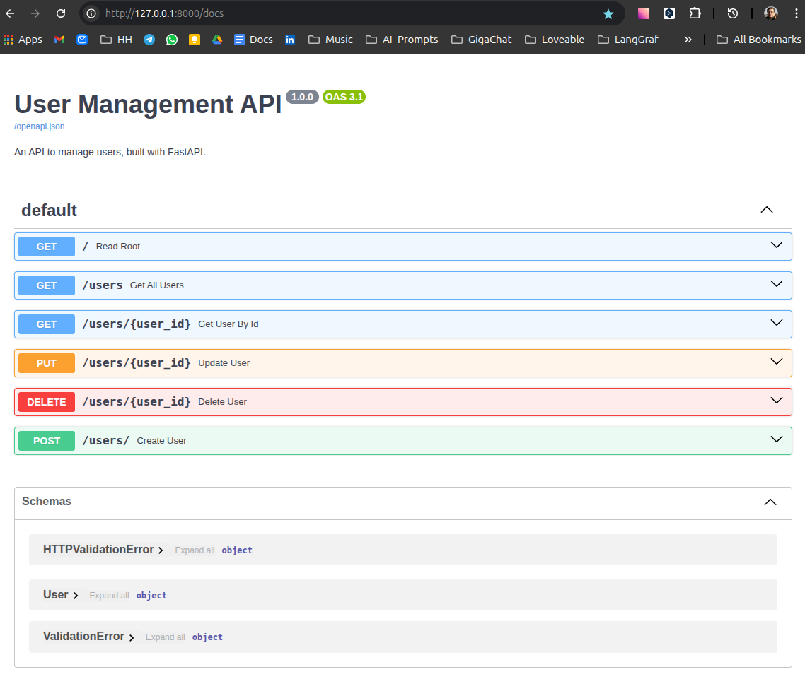
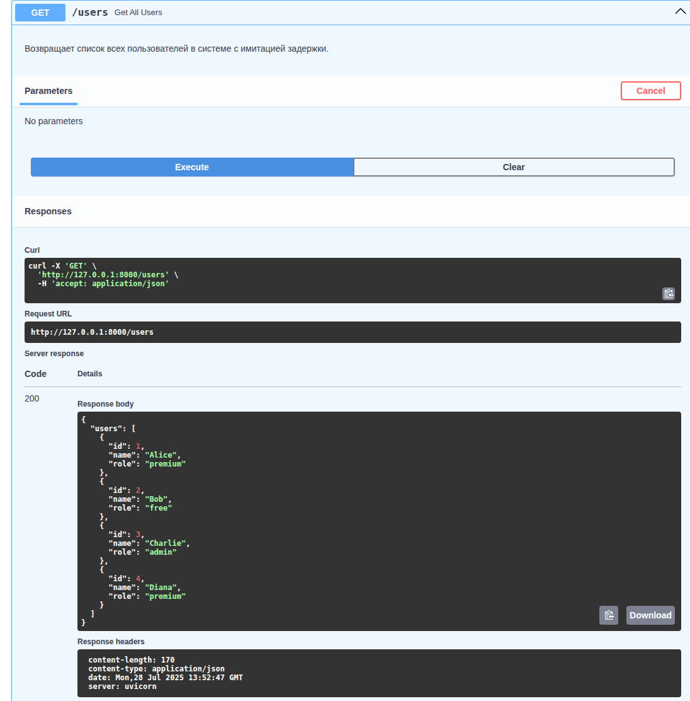

## Учебный курс по Python для разработчиков с опытом в JavaScript/Node.js

Этот репозиторий — практический учебный курс по Python для разработчиков с опытом в JavaScript/Node.js. Вы шаг за шагом строите современный backend на FastAPI, осваиваете работу с сервисным слоем, учитесь анализировать данные с помощью Pandas и интегрировать их в API.

### Структура проекта
- `main.py` — основной FastAPI-приложение (User Management API v2.0)
- `services.py` — сервисный слой (UserService) для бизнес-логики пользователей
- `data_analyzer.py` — скрипт для анализа CSV-данных с помощью Pandas
- `users_data.csv` — пример данных пользователей
- `requirements.txt` — все зависимости проекта
- `best_practise_learning.md`, `Day_2.md`, ... — подробные планы обучения по дням

---

## Быстрый старт

1. **Создайте и активируйте виртуальное окружение:**
   ```bash
   python3 -m venv venv
   source venv/bin/activate
   ```
2. **Установите зависимости:**
   ```bash
   pip install -r requirements.txt
   ```
3. **Запустите сервер:**
   ```bash
   uvicorn main:app --reload
   ```
   Откройте http://127.0.0.1:8000/ и http://127.0.0.1:8000/docs для Swagger UI.

---

## Возможности API (FastAPI)

- `GET    /` — приветствие
- `GET    /users` — получить всех пользователей
- `GET    /users/{user_id}` — получить пользователя по ID
- `POST   /users` — создать пользователя (требует name и role)
- `PUT    /users/{user_id}` — обновить пользователя
- `DELETE /users/{user_id}` — удалить пользователя

**Структура пользователя:**
```json
{
  "id": 1,
  "name": "Alice",
  "role": "premium"
}
```

### Сервисный слой (UserService)
- Инкапсулирует бизнес-логику CRUD для пользователей
- Легко расширяется и тестируется отдельно от FastAPI

---

## Анализ данных с Pandas

- `data_analyzer.py` — скрипт для анализа пользователей из CSV:
  - Чтение и базовый анализ данных
  - Фильтрация премиум-пользователей
  - Пример аналитики: среднее время с последнего логина
- Пример запуска:
  ```bash
  python data_analyzer.py
  ```
- Формат CSV (`users_data.csv`):
  ```csv
  id,name,role,signup_date,last_login_days_ago
  101,Frank,premium,2024-01-15,5
  ...
  ```

---

## Учебные планы по дням
- [best_practise_learning.md](./best_practise_learning.md) — лучшие практики организации кода и истории
- [Day_2.md](./Day_2.md) — функции, модули, pip, requests
- [Day_3.md](./Day_3.md) — FastAPI: первые API и документация
- [Day_4.md](./Day_4.md) — FastAPI: CRUD, асинхронность, Pydantic
- [Day_5_6.md](./Day_5_6.md) — ООП, сервисный слой, Pandas, интеграция анализа данных

---

## Зависимости

Все зависимости перечислены в `requirements.txt`. Основные:
- fastapi
- uvicorn
- pydantic
- pandas
- requests

---

## Скриншоты
- 
- 

---

## Контакты и поддержка

Если у вас есть вопросы или предложения — создайте issue или pull request!

